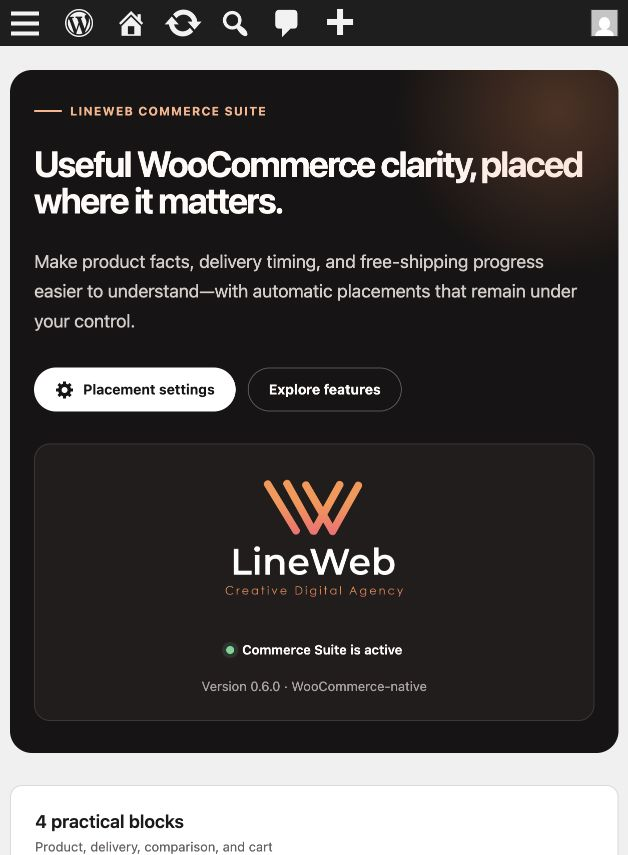
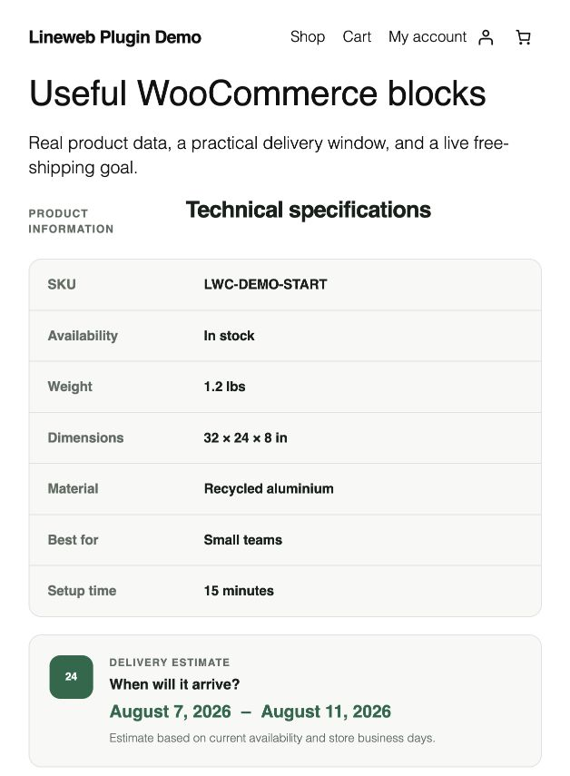
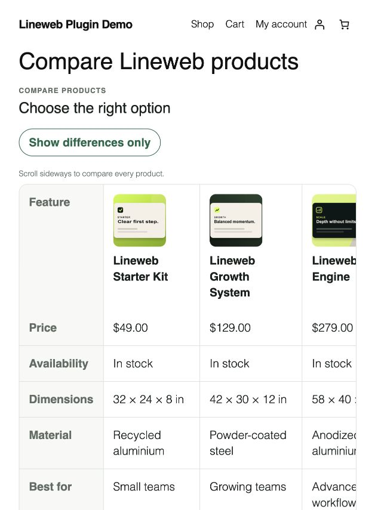
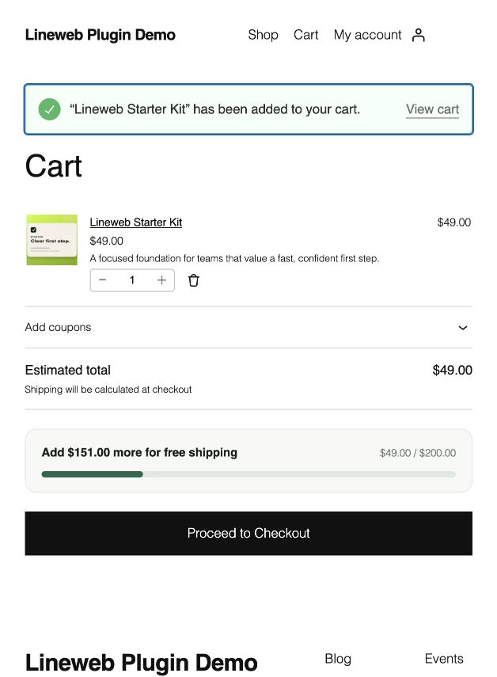

# Lineweb Commerce Suite — WooCommerce Blocks & Store UX Tools


A free WooCommerce blocks plugin for product specifications, delivery estimates, free-shipping progress, cart UX, and factual product comparisons. Selected tools can appear at official WooCommerce conversion points, while the merchant keeps control of every automatic placement.

- Live product and cart data from WooCommerce rather than a duplicate data source.
- Manual Gutenberg blocks plus controlled Product, Cart, and Mini-Cart integrations where appropriate.
- Semantic, server-rendered public markup with focused progressive enhancement.
- No telemetry, Lineweb account, external runtime service, or custom visitor-data store.
- English and Greek translations included.

The plugin is independent from [Lineweb Blocks Suite](https://lineweb.gr/). WooCommerce data access, compatibility declarations, settings, and cart behavior remain in their own release boundary.

## Included features

| Feature | Data and placement |
| --- | --- |
| **Product Specifications** | Shows the selected/current product's SKU, availability, weight, dimensions, and visible WooCommerce attributes. Add it manually to product templates, product content, landing pages, posts, or buying guides. |
| **Delivery Estimate** | Calculates a stock-aware window from a merchant-confirmed profile covering business days, cutoff, holidays, and stock behavior. It can be inserted manually or placed after add to cart on physical product pages. |
| **Free Shipping Progress** | Compares the live displayed cart subtotal with a manual threshold or the matching WooCommerce free-shipping method. It can be inserted manually or placed in Cart and Mini-Cart. |
| **Product Comparison** | Compares two to four published, catalog-visible products using live prices, availability, dimensions, selected visible attributes, and product links. It is manual by design. |

Automatic Delivery Estimate output stays paused until the merchant reviews and confirms the global delivery profile. Free Shipping Progress shows nothing when automatic mode cannot resolve a matching rule. Duplicate protection respects matching manual blocks in supported placement locations.

## Screenshots

All screenshots come from an isolated local demo store with synthetic products and cart data. No customer or order data is included.

<table>
  <tr>
    <td width="50%"><br><strong>1. Suite hub</strong><br>Feature navigation, placement status, settings, and merchant guidance.</td>
    <td width="50%"><br><strong>2. Product facts and delivery</strong><br>Live WooCommerce specifications followed by a confirmed delivery estimate.</td>
  </tr>
  <tr>
    <td><br><strong>3. Product Comparison</strong><br>A responsive table for live catalog products with a differences-only control.</td>
    <td><br><strong>4. Cart progress</strong><br>The live amount remaining before free shipping, placed before checkout.</td>
  </tr>
</table>

## Installation and setup

1. Install and activate WooCommerce.
2. In WordPress, go to **Plugins → Add New Plugin → Upload Plugin**.
3. Upload the release ZIP and activate **Lineweb Commerce Suite**.
4. Open **WooCommerce → Lineweb Commerce** to review the feature guide, diagnostics, and current placement status.
5. Open **WooCommerce → Settings → Products → Lineweb Commerce**.
6. Review delivery days, cutoff, holidays, and product-state behavior. Confirm the delivery profile only when those values match the store's real fulfilment process.
7. Enable only the Product, Cart, and Mini-Cart placements that fit the active theme and templates.
8. For automatic Free Shipping Progress, configure an eligible WooCommerce free-shipping method with a minimum amount. Use a manual threshold only when the displayed campaign goal is intentionally independent of zone detection.

## Using the blocks

- In a product template or product page, Product Specifications and Delivery Estimate can resolve the current product. In a regular post or page, select a product in the block settings.
- Add Product Comparison to a page, post, product, or buying guide and choose two to four published, catalog-visible products. Use the attribute controls to keep the comparison focused.
- Insert Free Shipping Progress manually only when an additional editorial placement is useful. Cart and Mini-Cart integrations are managed from the WooCommerce settings section.
- Test simple, variable, backordered, out-of-stock, and virtual products that exist in the actual catalog. Delivery output follows the configured profile and supported product state; it is an estimate, not a guarantee.

## Requirements

- WordPress 6.9 or newer
- WooCommerce 10.8 or newer
- PHP 8.3 or newer

For development and automated browser testing, the repository uses Node.js 22 and Docker.

## Accessibility and performance

- Semantic definition lists, tables, links, progress text, pressed states, and labelled estimates.
- Keyboard focus styling, responsive layouts, narrow-screen table scrolling, and controls that do not rely on hover alone.
- Product and comparison output is rendered through WooCommerce CRUD reads in PHP. Comparison products are read as a batch for one render rather than copied into plugin storage.
- Free Shipping Progress uses the WooCommerce Store API and WooCommerce cart events to refresh the display after normal cart changes; it does not reload or mutate the cart itself.
- Assets are scoped to the relevant block or WooCommerce placement.

Accessibility and layout still depend on the active theme and any customized WooCommerce templates. Test the complete Product, Cart, and Mini-Cart flows before release.

## Privacy and boundaries

The plugin does not add analytics, tracking cookies, lead forms, checkout fields, payment integrations, fees, discounts, shipping methods, inventory writes, order writes, or custom product schema. It reads WooCommerce product/cart data required to render the selected feature and does not create its own visitor profile or custom data table.

Delivery dates are estimates. Merchants remain responsible for accurate product data, fulfilment settings, shipping rules, caching behavior, and customer-facing disclosures.

## Development

From the repository root:

```bash
npm install
npm run build
npm run lint:js
npm run lint:css
npm run lint:php
npm run test:unit
```

The release package is created with `npm run plugin-zip` and contains the compiled runtime required by WordPress and WooCommerce.

## Support and security

- Read the repository [support policy](SUPPORT.md) before reporting a reproducible defect.
- Report suspected vulnerabilities privately according to the [security policy](SECURITY.md). Do not publish credentials, customer data, or production exports in an issue.
- General contact: [lineweb.gr/contact](https://lineweb.gr/contact/)

## License

GPL-2.0-or-later.
